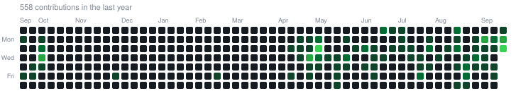

# Max Åstrand

[ LinkedIn](https://www.linkedin.com/in/max-%C3%A5strand-1a61113a0/) &nbsp;&bull;&nbsp; [ max.astrand@kthais.com](mailto:max.astrand@kthais.com)

Studying the Degree Programme in Information and Communication Technology, CINTE, at KTH Royal Institute of Technology in Stockholm.

Platform Engineer on the IT team at [KTH AI Society](https://kthais.com).

---

## Project overview

| Project | Focus | Role | Stack | Status |
| :--- | :--- | :--- | :--- | :--- |
| [sports-injury-indicator](https://github.com/de1vos/sports-injury-indicator) | Sports injury risk analytics | Backend developer | FastAPI, SQLModel, PostgreSQL | Public, team |
| [Custom-skills](https://github.com/Maxastrand04/Custom-skills) | Agent context and workflow control | Author | Bash, Claude Code, ADRs | Public, personal |
| [Vallentuna Stenugnsbageri](https://www.vsbageri.se) | Demand and sellout forecasting | ML engineer | Python, XGBoost, AFT loss | Private, production |

---

## Technical stack

### Core and tooling

### Agent tooling

### Coursework and foundations

---

## Contribution activity

---

## Projects

### [sports-injury-indicator](https://github.com/de1vos/sports-injury-indicator)
Collaborative sports analytics platform that predicts injury risk and recovery times for athletes.

I built the backend and database layer for the project.
- Designed the relational database schema with SQLModel and PostgreSQL.
- Built the REST API using FastAPI, defining endpoint queries and data formatting for the frontend.
- Structured prediction ingestion pipelines and ongoing injury severity calculation.

### [Custom-skills](https://github.com/Maxastrand04/Custom-skills)
Modular system of local development skills and configuration for Claude Code, built around context-window management and deterministic workflows.

- Self-contained skill architecture where each skill installs through symlinks and isolates its dependencies.
- Context control governed by architecture decision records, custom hooks, and stripped-down tool definitions.
- Multi-tier prompt enforcement to eliminate conversational fluff during extended sessions.

### Vallentuna Stenugnsbageri demand forecasting
Production machine learning system built for [Vallentuna Stenugnsbageri](https://www.vsbageri.se), also on [Instagram](https://www.instagram.com/vallentunastenugnsbageri/). The repository is private.

- Predicts daily item-level product demand to balance early sellouts against end-of-day waste.
- Accounts for censored demand on days when inventory sold out early, along with weekday patterns, weather inputs, and seasonal shifts.
- Remains closed-source because it runs on proprietary commercial sales and production records.
